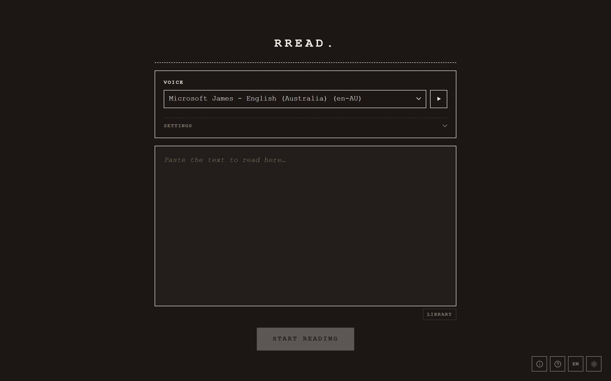
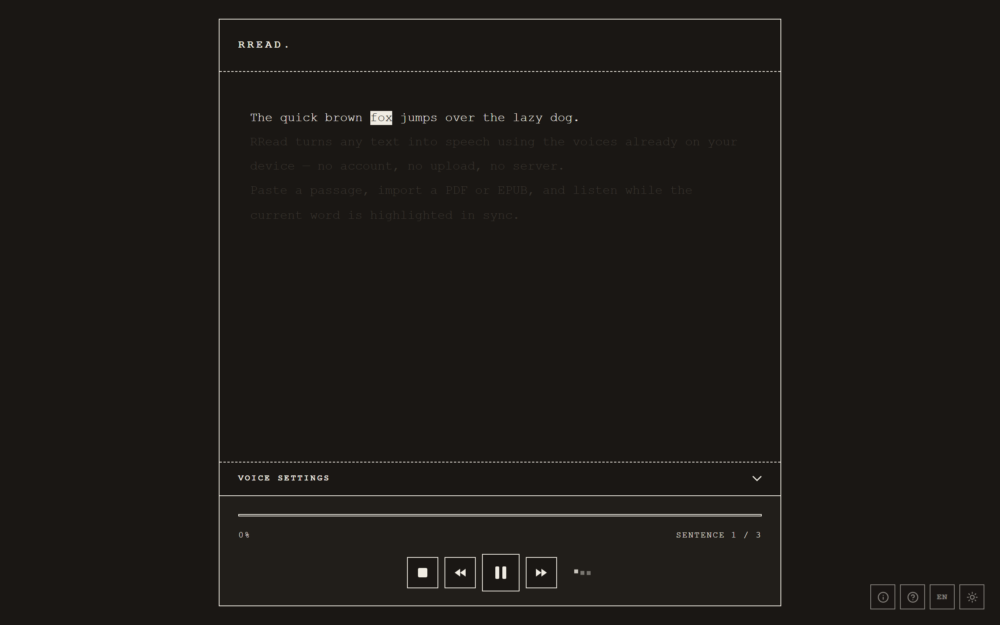
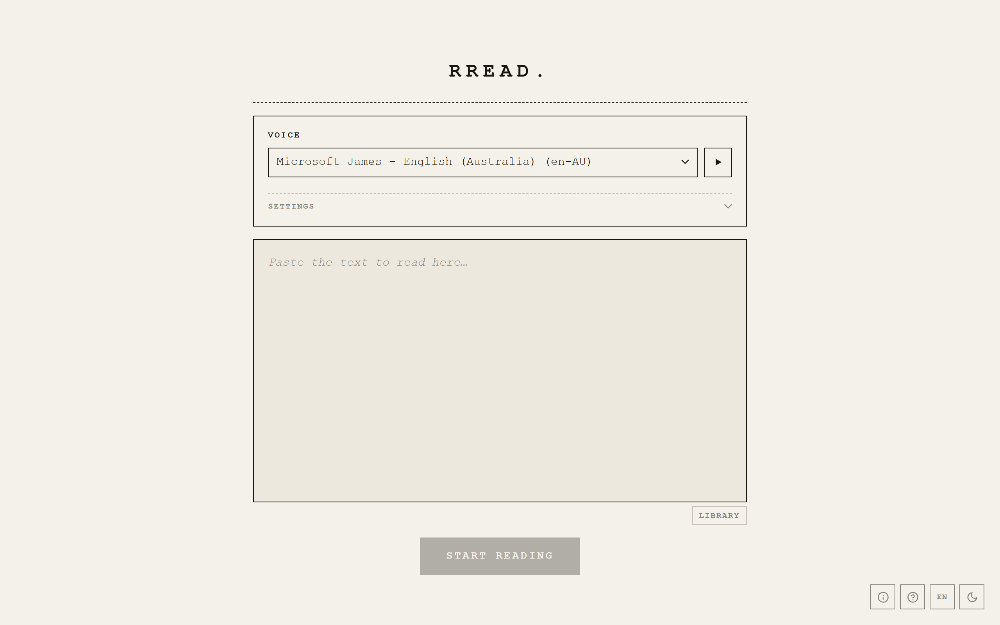
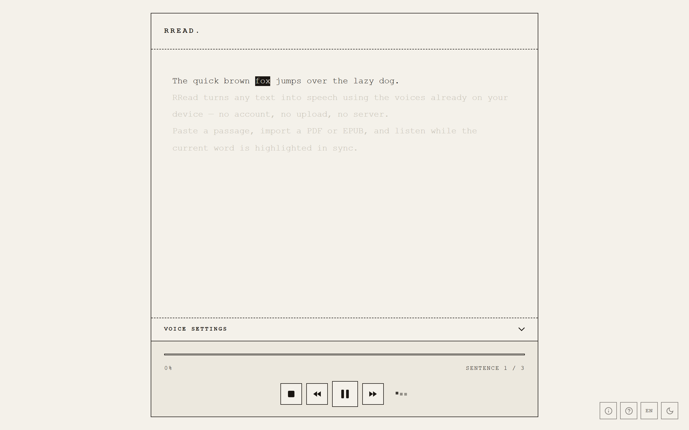

# RRead

A fast, private, browser-based text-to-speech reader. Paste text or import a document and listen to it read aloud using the speech voices already installed on your device — nothing is uploaded, and there's no account to create.

Everything runs client-side in the browser. PDFs and EPUBs are parsed locally, text and reading positions live in `localStorage`, and speech is produced by the built-in [Web Speech API](https://developer.mozilla.org/en-US/docs/Web/API/Web_Speech_API). No server, no API keys, no tracking.

## Screenshots

| Paste or import | Listen along |
| --- | --- |
|  |  |

RRead follows your system theme — here it is in light mode:

| Landing (light) | Reading (light) |
| --- | --- |
|  |  |

## Features

### Reading
- **Import documents** — TXT, MD, PDF, and EPUB, all parsed in-browser (PDF/EPUB loaders are loaded on demand to keep startup fast)
- **Word-level highlighting** — the current word is highlighted in sync with speech, and the view auto-scrolls to keep it centered
- **Click to seek** — click any word to jump playback to that point
- **Resume** — your position per document is saved automatically; reopen and pick up where you left off
- **Library** — saved texts are kept locally so you can switch between documents

### Voices & playback
- **Any installed voice** — choose from every voice available on your OS/browser
- **Adjustable speed, pitch, and volume**
- **Voice preview** — sample a voice before committing
- **Edge "Online" voice probing** — on Microsoft Edge, the high-quality online read-aloud voices are woken up automatically so they appear and work reliably

### Controls
- **Keyboard shortcuts** — `Space` play/pause, `←` previous sentence, `→` next sentence, `Esc` stop
- **OS media controls** — play/pause/skip from the lock screen, notification, or media keys via the Media Session API
- **Stays awake** — holds a screen wake lock while playing on Android so playback doesn't stall when the display blanks

### Interface
- **Dark / light theme** — follows your OS preference by default, toggleable
- **Localized UI** — English and Italian, auto-selected from your browser language
- **Responsive** — tailored layouts for desktop and mobile

## Tech stack

- **React 19** + **Vite**
- **Web Speech API** for synthesis (no external TTS service)
- **pdfjs-dist** and **epub.js** for document parsing (lazy-loaded)

## Getting started

```bash
npm install
npm run dev      # start the dev server
```

Then open the printed local URL in your browser.

## Building

```bash
npm run build    # production build to dist/
npm run preview  # serve the production build locally
```

## Project layout

```
src/
  components/   UI: TextInput, TextDisplay, Player, VoiceSettings, Library, …
  hooks/        useSpeech, useVoices, usePersistence, useMediaSession,
                useWakeLock, useSilentAudio, useKeyboardShortcuts, useLibrary
  utils/        text cleaning, sentence splitting, file import, language detection
  i18n.js       English/Italian translations
```

## Browser support

Works in any modern browser with the Web Speech API. Available voices, voice quality, and word-boundary highlighting depend on the browser and OS — Chrome, Edge, and Safari generally offer the best experience. Edge additionally provides high-quality online voices (see voice probing above).

## Notes

- Speech synthesis quality is provided entirely by your device — RRead does not bundle or stream any voices.
- All data stays on your device; clearing site data removes saved texts and positions.
